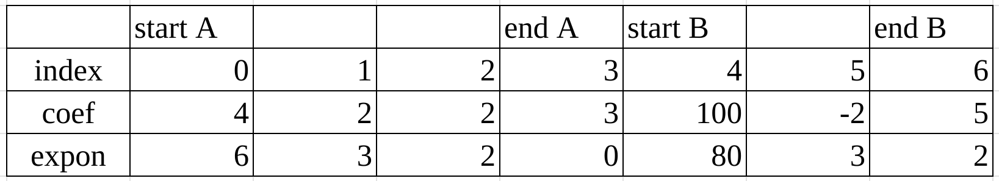

# Data Structure Homework 1

**Student ID : 41247001S**

### Question 1 (a)

Please show the content in the representation for a polynomial ADT   by storing the two polynomials in the same array.

$a(x) = 4x^6 + 2x^3 + 2x^2 + 3$ 
$b(x)= 100x^{80} -2x^3 + 5x^2$

### Answer 

### Question 1 (b)

How many times of the switch instruction within the while loop  will be executed by using the padd() function to add the above two polynomials a(x) and b(x)?  Please explain your answer.

### Answer

According to the padd() function in the picture,  we can see that it will keep attaching the highest exponents which hasn't been attached between $a(x)$ and $b(x)$.  

We can see the switch 0 :   It will attach both $a(x)$ and $b(x)$ if the highest exponents of $a(x)$ and $b(x)$ is same.

Therefore, we can conclude that the while loop will execute the amounts of terms with different exponents from $D(x),  (D(x) = a(x) + b(x))$.

For example : 

if $a(x) = 4x^3 + 2x + 1$ , $b(x) = 3x^3 + 3x^2 + 3$
then the amounts of terms with different exponents will be 4, since $D(x)$ will be $7x^3 + 3x^2 + 2x + 4$, and we can see that the amounts of terms with different exponents will be 4.