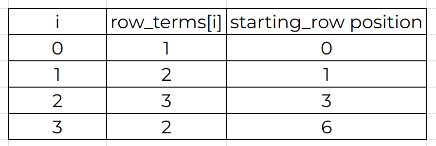
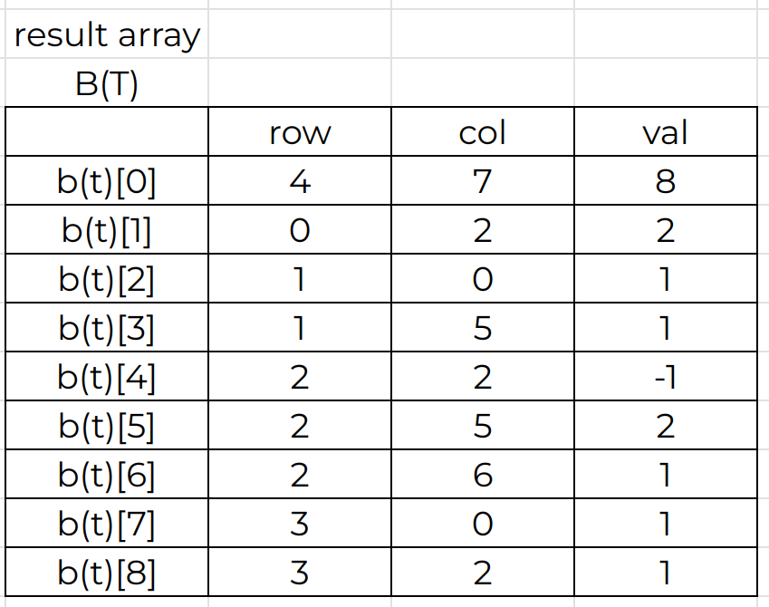

# Data Structure Homework 1

**Student ID : 41247001S**

### Question 1 (a)

Please show the content in the representation for a polynomial ADT   by storing the two polynomials in the same array.

$a(x) = 4x^6 + 2x^3 + 2x^2 + 3$ 
$b(x)= 100x^{80} -2x^3 + 5x^2$

### Answer 

### Question 1 (b)

How many times of the switch instruction within the while loop  will be executed by using the padd() function to add the above two polynomials a(x) and b(x)?  Please explain your answer.

### Answer

According to the padd() function in the picture,  we can see that it will keep attaching the highest exponents which hasn't been attached between $a(x)$ and $b(x)$.  

We can see the switch 0 :   It will attach both $a(x)$ and $b(x)$ if the highest exponents of $a(x)$ and $b(x)$ is same.

On the other hand, if the highesting exponents of $a(x)$ and $b(x)$ is different, it will attach the higher one. 

We can see that how the while loop end is when one of the $f(x)$ is completely attached to new matrix.  

Therefore, the total execute time will depends on the amounts of terms in $D(x)$ ($D(x) = a(x) + b(x)$)   which $\ge max(smallest_{exponent}a(x) , smallest_{exponent}b(x))$

The remaining terms will be execute after the while loop.

For example : 

if $a(x) = 4x^3 + 2x^2 + x$ , $b(x) = 3x^3 + 3x^2 + 3$
then the $max(smallest_{exponent}a(x) , smallest_{exponent}b(x))$ will be $1$ since the smallest exponent of $a(x) = 1$ , $b(x) = 0$

According to my conclusion above, the total execute time will be the amounts of exponents which $\ge 1$

The amounts of exponents which $\ge 1$ is $\set{3 , 2 , 1} = 3$

### Question 2 (a)

