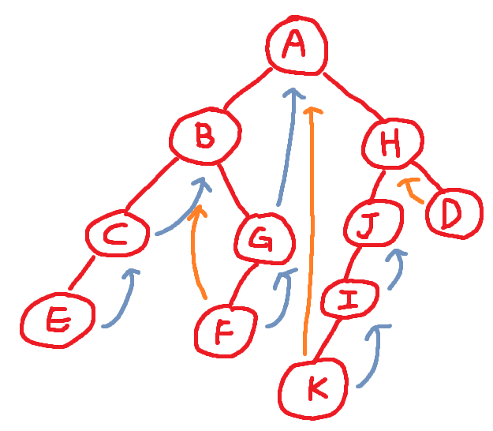
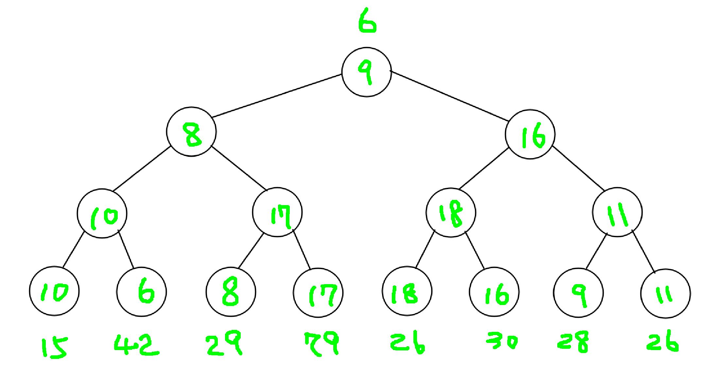
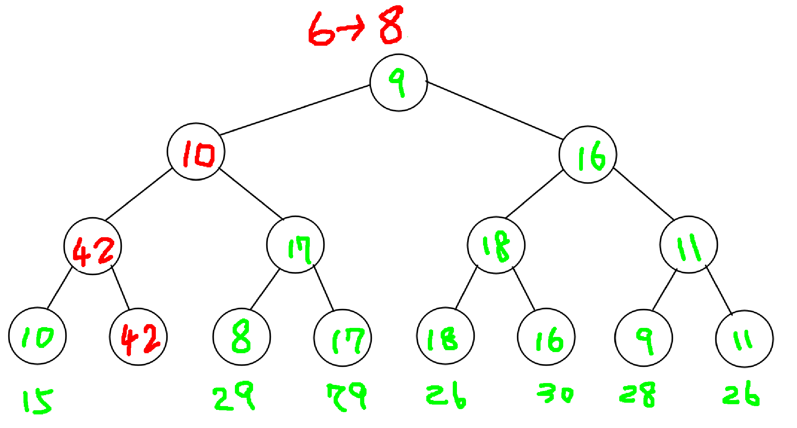
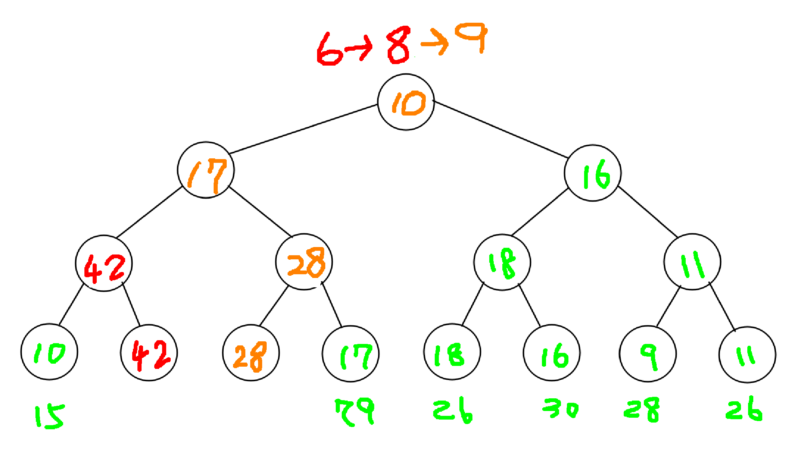

# Data Structure Homework 4

**Student ID : 41247001S**

### Question 1

(a.) Let n = T's level, then $2^{n-1}-1 < node  <= 2^n - 1$ (since T is a complete binary tree). Therefore, $2^{n-1}-1 < 400  <= 2^n - 1$ , $n=9$

(b.) Complete binary tree has $ceil(node/2)$ leaf nodes = $400/2 = 200$.

(c.) Since T is a complete binary tree with 9 levels, it is full on level 6, which has $2^{6-1} = 32$ nodes.

(d.) It stored at `arr[49]`.

(e.) `[1,3,7,15,31]`

(f.) `100`, since `floor(200/2) = 100`

(g.) `150 * 2 + 1 = 301`

(h.) The first element in a complete binary tree which has $n$ levels should be $2^{n-1}$ = $2^8 = 256$


### Question 2

(a) `ABCEGFHJIKD`
(b) `ECBFGAKIJHD`
(c) `ECFGBKIJDHA`
(d) `ABHCGJDEFIK`

### Question 3

(a) `blue is the successor(right threshold), orange is the predecessor(left threshold)`



(b) The original thread tree inorder travesal = `ECBFGAKIJHD`, After insert `L` as `B`'s right node, the inorder travesal become `ECBLFGAKIJHD`. Therefore, there are some modifications for the nodes.

```
B.right = L (was G)
F.left_thread = L (was B)
```

### Question 4


| |1|2|3|4|5|6|7|8|9|10|
|-|-|-|-|-|-|-|-|-|-|-|
|heap|20|25|30|35|28|50|65|45|50|43|
|-min|25|28|30|35|43|50|65|45|50|   
|+24|24|25|30|35|28|50|65|45|50|43|
|-min|25|28|30|35|43|50|65|45|50|
|+12|12|25|30|35|28|50|65|45|50|43|
|-min|25|28|30|35|43|50|65|45|50|
|+60|25|28|30|35|43|50|65|45|50|60|

### Question 5

First element 


Second element


Therefore, the third element is 9.



