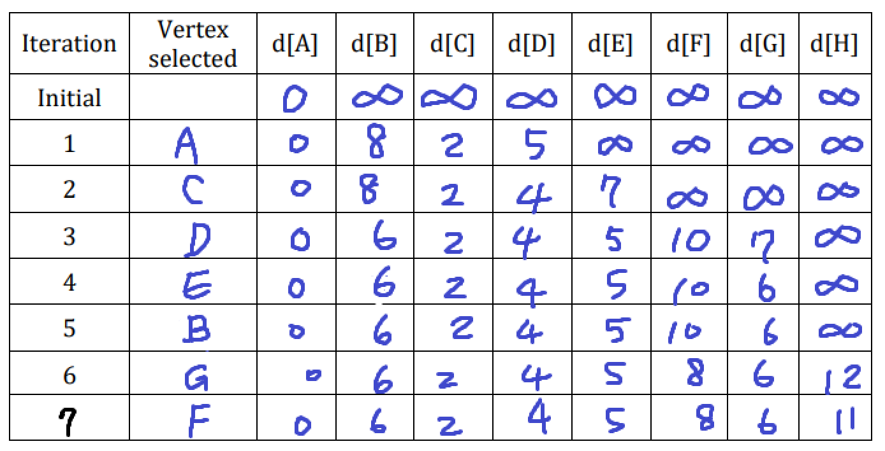
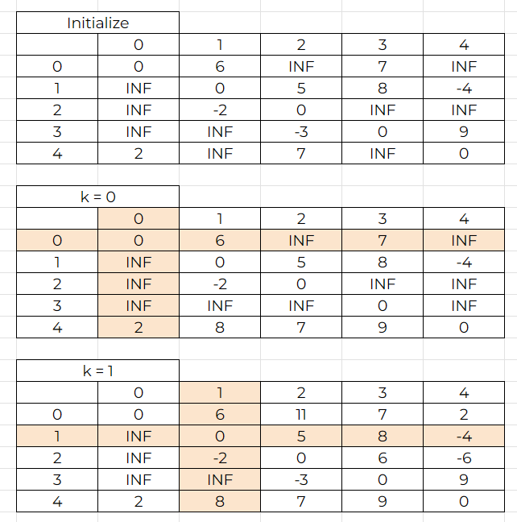
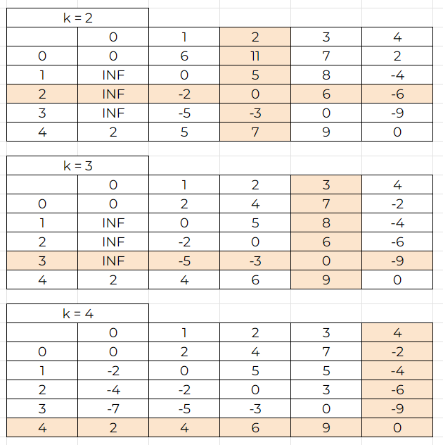
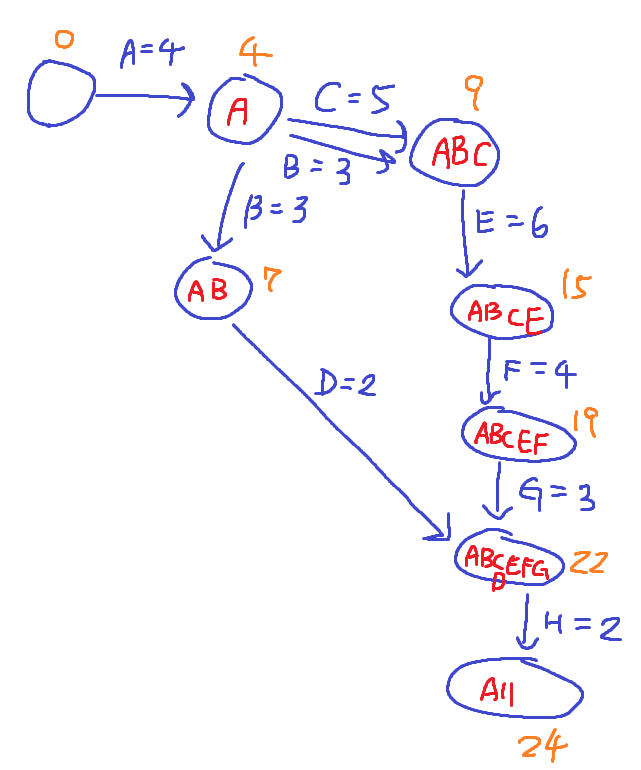
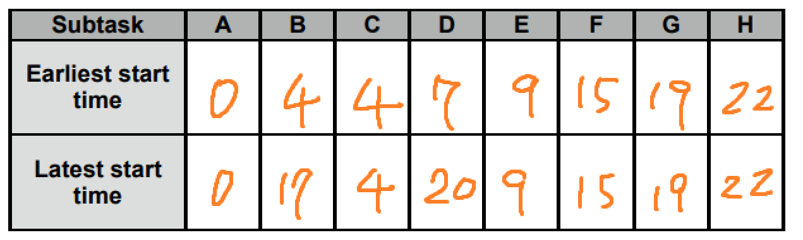

## Data Structure Homework VI

##### 41247001S 盧昱安

#### Question 1

#### Question 2

#### Question 3

3-1

3-2

3-3
A->C->E->F->G->H
Because Earliest = Latest

3-4
Yes, because E is critical activity.